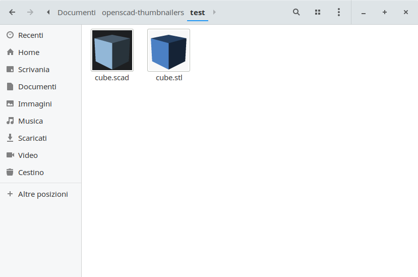

# Openscad thumbnailers

This project allows Nautilus (but also Nemo, Caja and PCManFM) to show thumbnails for `.stl` and `.scad` files.

**Openscad, imagemagick and sudo are required**

To install, open a terminal into this directory and execute `./install.sh`.
